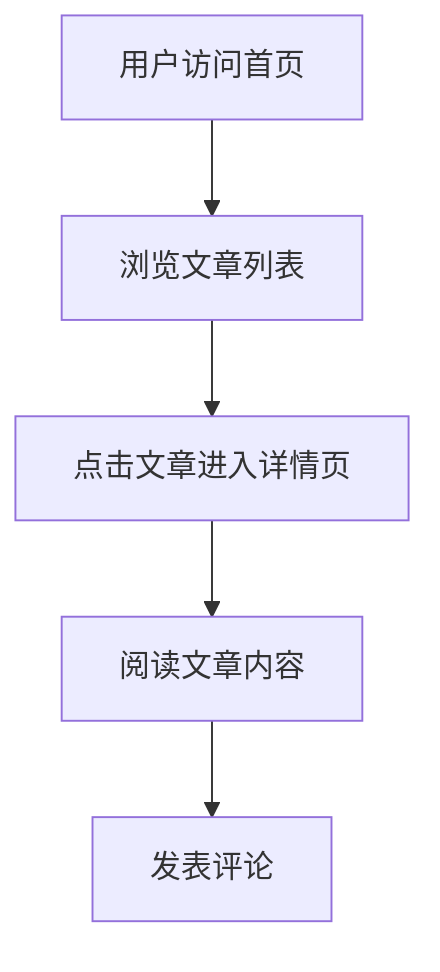

## 1. 产品概述
动态博客网站，提供内容发布、浏览和互动功能，满足个人和小团队的内容创作需求。
- 解决用户快速搭建个人或团队博客的需求，提供简洁易用的内容管理系统
- 目标用户为个人博主、技术团队、内容创作者，市场价值在于降低技术门槛，提升内容创作效率

## 2. 核心功能

### 2.1 用户角色
| 角色 | 注册方式 | 核心权限 |
|------|----------|----------|
| 访客 | 无需注册 | 浏览文章、评论 |

### 2.2 功能模块
1. **首页**：英雄区、导航栏、文章列表、分类筛选
2. **文章详情页**：文章内容、评论区、相关推荐

### 2.3 页面详情
| 页面名称 | 模块名称 | 功能描述 |
|---------|---------|----------|
| 首页 | 英雄区 | 展示博客主题和特色，支持图片轮播 |
| 首页 | 导航栏 | 包含博客标题、分类菜单、搜索功能 |
| 首页 | 文章列表 | 以卡片形式展示文章，包含标题、摘要、发布时间、分类标签 |
| 首页 | 分类筛选 | 按分类过滤文章，支持标签云展示 |
| 文章详情页 | 文章内容 | 展示完整文章，支持富文本格式 |
| 文章详情页 | 评论区 | 支持用户发表评论 |
| 文章详情页 | 相关推荐 | 根据当前文章标签推荐相关文章 |

## 3. 核心流程
用户访问博客网站，浏览首页文章列表，点击感兴趣的文章进入详情页阅读，可在评论区发表评论。

## 4. 用户界面设计
### 4.1 设计风格
- 主色调：#3B82F6（蓝色）、#1F2937（深灰）
- 辅助色：#F3F4F6（浅灰）、#10B981（绿色）
- 按钮风格：圆角设计，悬停效果
- 字体：Inter（无衬线字体），标题18-24px，正文14-16px
- 布局风格：卡片式布局，响应式设计
- 图标风格：线性图标，简洁现代

### 4.2 页面设计概览
| 页面名称 | 模块名称 | UI元素 |
|---------|---------|--------|
| 首页 | 英雄区 | 全宽背景图片，居中标题和副标题，渐变遮罩效果 |
| 首页 | 导航栏 | 固定顶部，白色背景，阴影效果，响应式菜单 |
| 首页 | 文章列表 | 网格布局，卡片带阴影，悬停时轻微上浮效果 |
| 首页 | 分类筛选 | 标签按钮组，选中状态高亮显示 |
| 文章详情页 | 文章内容 | 白色背景，干净排版，适当行间距，图片自适应 |
| 文章详情页 | 评论区 | 卡片式评论，嵌套回复，表单输入区域 |
| 文章详情页 | 相关推荐 | 侧边栏或底部列表，卡片式展示 |
| 后台管理 | 文章管理 | 表格布局，编辑按钮，状态标签 |
| 后台管理 | 评论管理 | 表格布局，审核状态，操作按钮 |
| 后台管理 | 用户管理 | 表格布局，权限级别，操作按钮 |

### 4.3 响应式设计
- 桌面优先设计，适配平板和移动设备
- 移动设备上导航栏转为汉堡菜单
- 文章列表在移动设备上改为单列布局
- 评论区在移动设备上简化布局

### 4.4 交互设计
- 平滑滚动效果
- 按钮和链接悬停动画
- 页面加载过渡效果
- 表单提交反馈动画