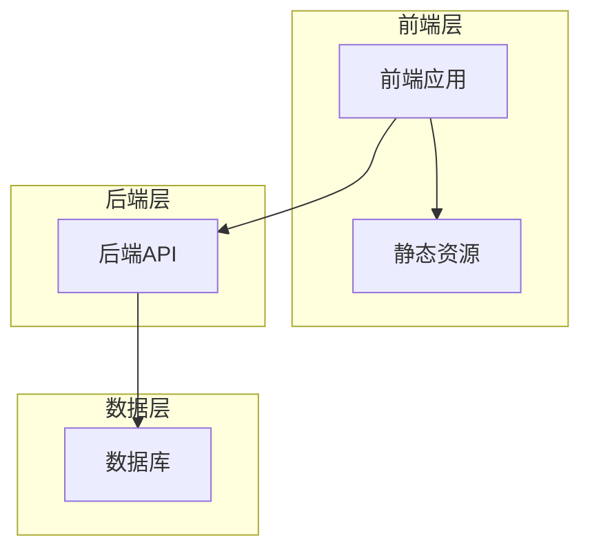
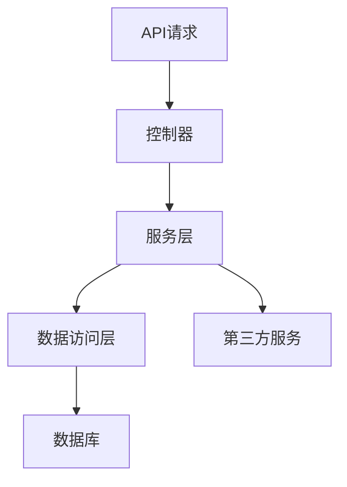
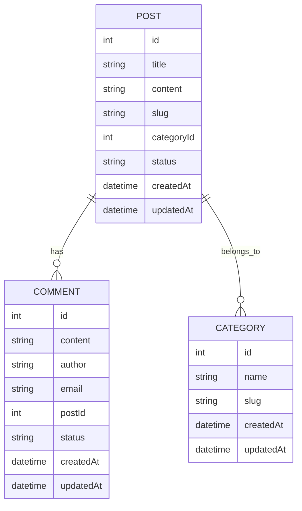

## 1. 架构设计


## 2. 技术描述
- 前端：Vue 3 + TypeScript + Tailwind CSS + Vite
- 初始化工具：Vite
- 后端：Express.js + TypeScript
- 数据库：SQLite
- 部署：静态文件部署 + 后端API部署

## 3. 路由定义
| 路由 | 用途 |
|------|------|
| / | 首页，展示文章列表 |
| /post/:id | 文章详情页 |
| /category/:slug | 分类页面，展示特定分类的文章 |

## 4. API定义

### 4.1 文章相关API
| 方法 | 路径 | 功能 | 请求体 | 响应 |
|------|------|------|--------|------|
| GET | /api/posts | 获取文章列表 | N/A | `{ "posts": [{ "id": 1, "title": "...", "content": "...", "createdAt": "..." }] }` |
| GET | /api/posts/:id | 获取文章详情 | N/A | `{ "post": { "id": 1, "title": "...", "content": "...", "createdAt": "..." } }` |
| GET | /api/posts/category/:slug | 获取分类文章 | N/A | `{ "posts": [{ "id": 1, "title": "...", "content": "...", "createdAt": "..." }] }` |

### 4.2 评论相关API
| 方法 | 路径 | 功能 | 请求体 | 响应 |
|------|------|------|--------|------|
| GET | /api/posts/:id/comments | 获取文章评论 | N/A | `{ "comments": [{ "id": 1, "content": "...", "createdAt": "...", "author": "..." }] }` |
| POST | /api/comments | 创建评论 | `{ "postId": 1, "content": "...", "author": "...", "email": "..." }` | `{ "comment": { "id": 1, "content": "..." } }` |

### 4.3 分类相关API
| 方法 | 路径 | 功能 | 请求体 | 响应 |
|------|------|------|--------|------|
| GET | /api/categories | 获取分类列表 | N/A | `{ "categories": [{ "id": 1, "name": "...", "slug": "..." }] }` |

## 5. 服务器架构图


## 6. 数据模型

### 6.1 数据模型定义


### 6.2 数据定义语言

#### 创建分类表
```sql
CREATE TABLE categories (
    id INTEGER PRIMARY KEY AUTOINCREMENT,
    name TEXT NOT NULL,
    slug TEXT UNIQUE NOT NULL,
    created_at TIMESTAMP DEFAULT CURRENT_TIMESTAMP,
    updated_at TIMESTAMP DEFAULT CURRENT_TIMESTAMP
);
```

#### 创建文章表
```sql
CREATE TABLE posts (
    id INTEGER PRIMARY KEY AUTOINCREMENT,
    title TEXT NOT NULL,
    content TEXT NOT NULL,
    slug TEXT UNIQUE NOT NULL,
    category_id INTEGER,
    status TEXT NOT NULL DEFAULT 'published',
    created_at TIMESTAMP DEFAULT CURRENT_TIMESTAMP,
    updated_at TIMESTAMP DEFAULT CURRENT_TIMESTAMP,
    FOREIGN KEY (category_id) REFERENCES categories(id)
);
```

#### 创建评论表
```sql
CREATE TABLE comments (
    id INTEGER PRIMARY KEY AUTOINCREMENT,
    content TEXT NOT NULL,
    author TEXT NOT NULL,
    email TEXT NOT NULL,
    post_id INTEGER NOT NULL,
    status TEXT NOT NULL DEFAULT 'approved',
    created_at TIMESTAMP DEFAULT CURRENT_TIMESTAMP,
    updated_at TIMESTAMP DEFAULT CURRENT_TIMESTAMP,
    FOREIGN KEY (post_id) REFERENCES posts(id)
);
```

#### 创建索引
```sql
CREATE INDEX idx_posts_category_id ON posts(category_id);
CREATE INDEX idx_comments_post_id ON comments(post_id);
```

#### 初始化数据
```sql
-- 创建默认分类
INSERT INTO categories (name, slug) VALUES 
    ('技术', 'tech'),
    ('生活', 'life'),
    ('旅行', 'travel'),
    ('美食', 'food');

-- 创建示例文章
INSERT INTO posts (title, content, slug, category_id, status) VALUES 
    ('Vue 3 新特性介绍', 'Vue 3 带来了许多令人兴奋的新特性，包括 Composition API、Teleport、Fragments 等。本文将详细介绍这些新特性的使用方法和最佳实践。', 'vue-3-features', 1, 'published'),
    ('如何开始你的博客之旅', '博客是分享知识和经验的绝佳平台。本文将指导你如何选择平台、定位内容、建立受众群体，以及如何保持持续创作的动力。', 'start-blogging', 2, 'published'),
    ('日本京都旅行攻略', '京都作为日本的古都，拥有丰富的历史文化遗产。本文将分享京都的必访景点、美食推荐、交通指南，以及最佳旅行季节。', 'kyoto-travel-guide', 3, 'published'),
    ('家常川菜 recipes', '川菜以其麻辣鲜香著称。本文将分享几道经典家常川菜的制作方法，包括麻婆豆腐、水煮鱼、宫保鸡丁等，让你在家也能享受正宗川菜。', 'sichuan-recipes', 4, 'published');

-- 创建示例评论
INSERT INTO comments (content, author, email, post_id, status) VALUES 
    ('这篇文章非常详细，对我学习 Vue 3 很有帮助！', '张三', 'zhangsan@example.com', 1, 'approved'),
    ('期待更多关于 Composition API 的深入讲解', '李四', 'lisi@example.com', 1, 'approved'),
    ('我也想开始写博客，但是不知道从哪里入手', '王五', 'wangwu@example.com', 2, 'approved'),
    ('京都一直是我想去的地方，感谢分享！', '赵六', 'zhaoliu@example.com', 3, 'approved');
```